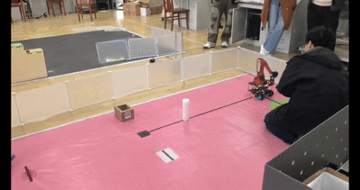
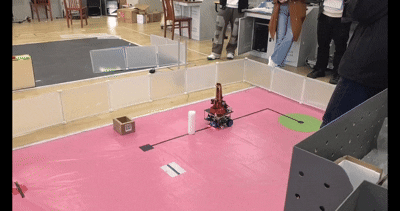
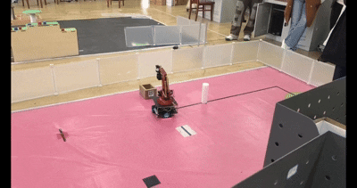

# 🚚 Autonomous Logistics Trolley (Automated Guided Vehicle)


An autonomous logistics trolley system designed for robotic competitions, featuring an omnidirectional chassis, a multi-DOF robotic arm, and sensor fusion for obstacle avoidance and precise material handling. 

This repository serves as a **Monorepo** containing the complete engineering files: **Embedded Firmware, Custom PCB Hardware, 3D Mechanical Models, and System Documentation.**

## 🎥 Demos & Performance
| Right-Angle Turning | **Obstacle Avoidance** |
| :---: | :---: |
|  |  |
| **Target Dropping / Manipulation** | Wireless Cruising |
|  |  |

> **📺 Full Video Demo:** [Click here to watch the complete run on Bilibili](https://www.bilibili.com/video/BV1SUR1BUEDi/?spm_id_from=333.1387.homepage.video_card.click&vd_source=a3d79e63ae261ce278c12c5cd8c60479) ## 🛠️ System Architecture

The project is decoupled into three independent sub-systems, communicating via serial protocols to ensure modularity and high real-time performance.

### 1. Firmware (`/firmware`)
Developed in C using the STM32 Standard Peripheral Library (SPL). 
- **Chassis Controller (`chassis_controller`):** Handles low-level motor driving, encoder reading, and **Closed-loop PID control** for precise velocity and position tracking. Integrates an MPU6050 IMU for attitude estimation.
- **Upper Sensor Node (`upper_sensor`):** Gathers environmental data using **VL53L0X ToF (Time-of-Flight) Laser Sensors** to perform obstacle avoidance and alignment.
- **Robotic Arm Controller (`robot_arm`):** Manages multi-axis PWM servo control for grasping and dropping payloads.

### 2. Hardware (`/hardware`)
Custom-designed PCBs to decouple power, logic, and motor drivers.
- **Schematics:** Available in `.esch` (EasyEDA) and `.pdf` formats.
- **Manufacturing:** Ready-to-produce `Gerber` files are provided for straightforward fabrication.

### 3. Mechanical (`/mechanical`)
- Contains the full assembly models (`.STEP` and SolidWorks `.SLDPRT`) of the trolley chassis and the robotic manipulator, ensuring structural integrity and easy 3D printing/CNC routing.

## 📂 Repository Layout

```text
logistics-trolley/
├── docs/                   # System diagrams (.drawio), LaTeX reports, and asset images
├── firmware/               # Keil MDK-ARM projects for the 3 STM32 nodes
│   ├── chassis_controller/ # PID motor control, IMU, kinematics
│   ├── robot_arm/          # Multi-DOF servo manipulation
│   └── upper_sensor/       # VL53L0X ToF array and environmental sensing
├── hardware/               # EDA files for custom PCBs
│   ├── gerber/             # Manufacturing files (Ready for JLCPCB)
│   └── schematics/         # Circuit diagrams (PDF & EasyEDA source)
└── mechanical/             # CAD models for 3D printing and assembly (.STEP)
